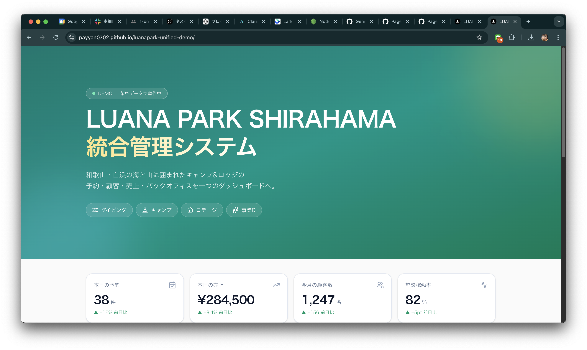
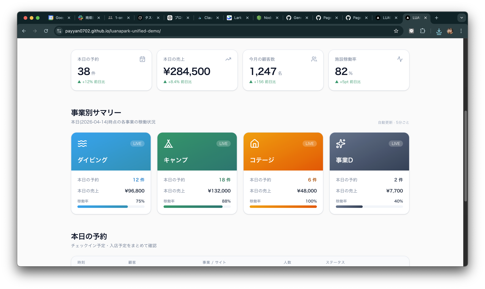
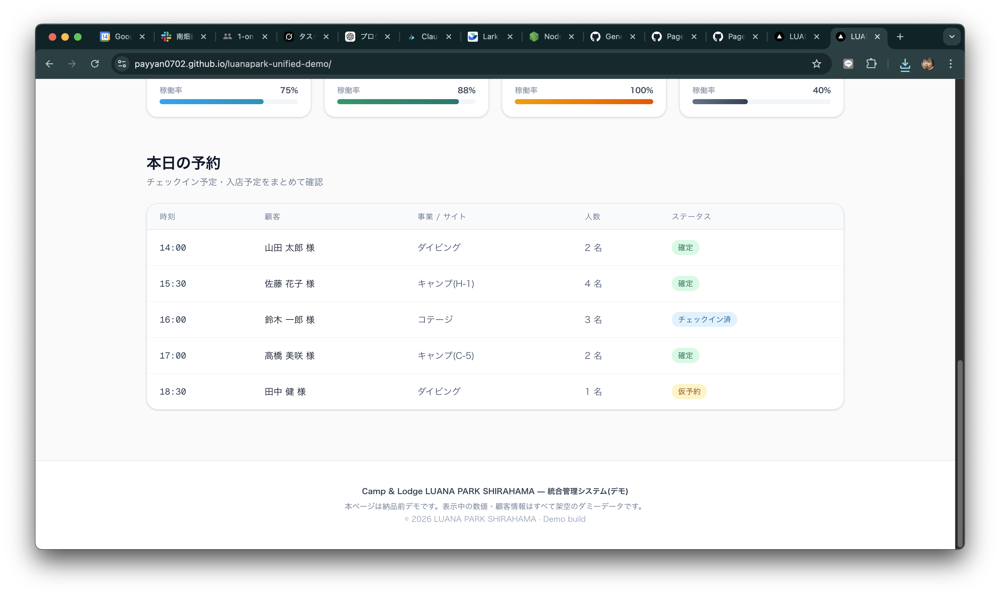

# LUANA PARK SHIRAHAMA — 統合管理システム(デモ)

Camp & Lodge LUANA PARK SHIRAHAMA の予約・顧客・売上・バックオフィスを
一つのダッシュボードに統合する管理システムの **GitHub 完結型デモ実装**です。

> ⚠️ このリポジトリはデモ用です。表示中の数値・顧客情報はすべて架空のダミーデータです。

## 🎬 デモを見る

**👉 [https://payyan0702.github.io/luanapark-unified-demo/](https://payyan0702.github.io/luanapark-unified-demo/)**

ブラウザで開くだけで動きます。サインアップ不要。

## 📸 スクリーンショット

### ヒーロー + KPI


### 事業別ダッシュボード


### 本日の予約テーブル


## ✨ 主な機能(デモ時点)

- **ヒーローセクション**: ブランドアイデンティティと対象4事業(ダイビング / キャンプ / コテージ / 事業D)の提示
- **KPI カード**: 本日の予約 / 本日の売上 / 今月の顧客数 / 施設稼働率
- **事業別サマリー**: 4事業それぞれの予約数・売上・稼働率を色分けカードで表示
- **本日の予約テーブル**: チェックイン予定・入店予定を時刻順に一覧
- すべて架空のダミーデータ、Server Component で構成

## 🛠 技術スタック

- **Frontend**: Next.js 16 (App Router) + TypeScript + Tailwind CSS v4
- **UI**: shadcn/ui + lucide-react
- **配信**: GitHub Pages(静的エクスポート、`next build` の `output: "export"`)
- **CI/CD**: GitHub Actions(lint / typecheck / test / build + Pages 自動デプロイ)

本番移行時は以下への差し替えを想定:
- DB: SQLite + Prisma → PostgreSQL(Prisma の datasource 変更のみ)
- Auth: NextAuth Credentials → メール認証 + MFA
- ホスティング: GitHub Pages → Vercel 等

## 🚀 ローカルで動かす

```bash
git clone https://github.com/payyan0702/luanapark-unified-demo.git
cd luanapark-unified-demo
npm install
npm run dev
```

ブラウザで http://localhost:3000 を開く。

静的エクスポート版をローカルで確認したい場合:

```bash
npm run build:demo
```

生成物は `out/` ディレクトリに出力されます。

## 📂 ディレクトリ構成

- `SPEC/` — 要件・設計ドキュメント
- `Project_Memory/` — 作業計画(task.json)と playbook
- `.claude/` — Claude Code 用の agents / commands / skills
- `.github/workflows/` — CI と Pages デプロイ
- `src/app/` — Next.js App Router(現状はトップ画面のみ)
- `docs/screenshots/` — README 用スクリーンショット

## 🗺 今後のロードマップ

本デモは **見た目優先のトップ画面のみ** を先行実装したものです。
打ち合わせ後に以下の順で継続実装予定:

- **Phase 0 残タスク**: Prisma + SQLite / NextAuth / seed / README整備
- **Phase 1**: 旧システムからの CSV 移行(顧客 / 予約 / 売上)
- **Phase 2**: 顧客一覧 / 予約カレンダー / 売上入力 / ダッシュボード本実装

詳細は [`SPEC/`](./SPEC/) 配下を参照。

## 📝 ライセンス

Proprietary(クライアント納品用)